# dakoku-web
勤怠打刻システムのユーザー管理WEBサーバー

## Structure



## Install

### Requirements

* Node10.x
* npm
* gcloud
    * Cloud Datastore Emulator

### Dependencies

`npm install`

## Create Task Queue

Task Queue **only** create from CLI.

[App Engine キューの作成](https://cloud.google.com/tasks/docs/creating-appengine-queues?hl=ja)

注意) `転送設定` で `dakoku-script` サービスへ `--routing-override` を指定すること

## Run Local

### Environment

* CLIENT_ID Servive Account client id, for using at OAuth2Client
* SECRET_KEY Secret key string, for crypting user password on Cloud Datastore
* DAKOKU_QUEUE_DAKOKU_SCRIPT Queue name of AppEngine Task Queue for execute dakoku-script service
* DAKOKU_LOCATION Google AppEngine location where the app deployed
* GOOGLE_CLOUD_PROJECT Google AppEngine project id is only set on local environment

### Server

```
npm run local

Server listening on port 8080...
Executing: /google-cloud-sdk/platform/cloud-datastore-emulator/cloud_datastore_emulator create --project_id=dakoku /Users/home/.config/gcloud/emulators/datastore
[datastore] 12 26, 2018 3:09:45 午後 com.google.cloud.datastore.emulator.CloudDatastore$CreateAction$1 apply
[datastore] 情報: Provided project_id to Cloud Datastore emulator create command, which is no longer necessary.
....
[datastore] API endpoint: http://localhost:8081
[datastore] If you are using a library that supports the DATASTORE_EMULATOR_HOST environment variable, run:
[datastore] 
[datastore]   export DATASTORE_EMULATOR_HOST=localhost:8081
[datastore] 
[datastore] Dev App Server is now running.
[datastore] 
[datastore] The previous line was printed for backwards compatibility only.
[datastore] If your tests rely on it to confirm emulator startup,
[datastore] please migrate to the emulator health check endpoint (/). Thank you!
```

1. Open browser http://localhost:8080 .
1. Log in user on esm account.

### GUI for Datastore Emulator

1. run `npm run gui` 
1. create Projects
  * Project ID: `dakoku-187702`
  * API Endpoint: `localhost:8081`
